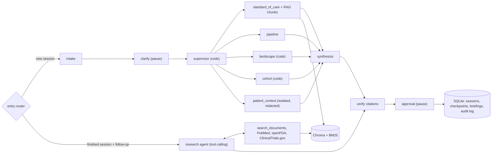

# Condition Briefing Agent (demo)

A web chat tool for a health system's strategy and planning team. An analyst types a condition (the demo uses
**dementia**), answers three clarifying questions, and gets a cited briefing in about 10-12 seconds:

- standard of care and approved products (FDA labels),
- the treatment pipeline (ClinicalTrials.gov),
- key companies and institutions,
- de-identified panel statistics for our own patients,
- what our internal documents say (capacity, payer policy, referrals, workforce), and
- optional context for one patient, redacted and labeled "clinician review required".

Every claim cites a PMID, an NCT ID, an FDA application number, or an internal document chunk
(`DOC:<doc_id>#<n>`). Claims that can't be tied to a retrieved source are dropped. An analyst approves or rejects
each draft before it is marked final. After a briefing, the analyst can ask follow-up questions in the same
session, and a research agent answers them from our documents and the public sources.

**Who it's for:** strategy analysts, service-line leaders and planning committees deciding where a health system
should invest (infusion capacity, memory clinic access, trial participation, payer readiness).
**Outcome:** a first-draft briefing in seconds instead of days of desk research, with every statement traceable.

> **Data notice.** All patient records and all Northlake Health documents in this repo are **synthetic**, made up
> for the demo. Northlake Health is fictional. Public data comes from PubMed, openFDA and ClinicalTrials.gov.

## Architecture



- **Orchestration: a code supervisor plus one tool-calling agent (LangGraph).** The briefing workflow is fixed, so
  a plain-code supervisor fans out to five parallel steps with `Send`. Each step makes one structured model call or
  runs plain code. That keeps it predictable and fast. Follow-up questions are open-ended, so that path is a real
  agent (`bind_tools` + `ToolNode`, capped at 6 tool calls) that chooses its own tools.
- **Trust boundary.** `patient_context` is the only step that sees patient data, and only after redaction. The
  follow-up agent has no patient tools and its input has the patient section removed. No public API query ever
  carries patient details.
- **Pauses (human in the loop).** LangGraph interrupts pause for the clarifying answers and for analyst approval.
  Checkpoints live in SQLite, so a session can be resumed after a server restart.
- **RAG.** Internal documents are split on headings, embedded with OpenAI `text-embedding-3-large` and stored in a
  persistent Chroma collection (one collection per embedding model). Search runs dense top 20 and BM25 top 20,
  merges them with reciprocal rank fusion, reranks with Pinecone-hosted `bge-reranker-v2-m3` to the top 5, and
  reports "not in our documents" below a score threshold.
- **Model.** DeepSeek `deepseek-flash` through `langchain-deepseek`, thinking disabled, temperature 0,
  schema-locked (Pydantic) outputs.
- **Observability.** LangSmith project `live-build-interview`, through an explicit tracer whose client redacts
  every traced input and output. Analyst approve/reject is recorded as LangSmith feedback.

## Run

Requires Python 3.11+ (tested with 3.12).

```bash
cd build
python -m venv .venv && .venv/bin/pip install -r requirements.txt   # or reuse an existing venv

# Secrets: environment variables, else macOS Keychain (account = your login, or set KEYCHAIN_ACCOUNT)
export DEEPSEEK_API_KEY=...     # Keychain service codex-deepseek-interviews
export OPENAI_API_KEY=...       # codex-openai-interviews     (embeddings)
export PINECONE_API_KEY=...     # codex-pinecone-interviews   (reranker; fallback embeddings)
export LANGSMITH_API_KEY=...    # codex-langsmith-personal-key (traces, experiments)

.venv/bin/python -m app.rag ingest                    # embed corpus/ into data/chroma/ (skips unchanged files)
.venv/bin/python -m app.rag search "infusion chairs"  # try retrieval
.venv/bin/python -m uvicorn app.main:app --port 8000  # open http://127.0.0.1:8000
```

API calls need an `X-User` header (the web page sets it). Main endpoints: `POST /api/chat`, `GET /api/sessions`,
`GET /api/sessions/{thread_id}`, `GET|POST /api/documents`, `GET /api/briefings`, `GET /api/audit`.

Config: `HEALTH_SYSTEM_STATE` (default Illinois), `COHORT_MIN_CELL` (default 3), `EMBED_PROVIDER`
(`openai` or `pinecone`), `RERANK` (`on`/`off`), `RETRIEVE_TOP_K`, `RERANK_MIN_SCORE`, `BRIEFING_DATA_DIR`,
`BRIEFING_TRACING=off` to disable traces.

## Evaluation

```bash
.venv/bin/python -m evals.run_eval                       # deterministic checks + 5 live end-to-end briefings
.venv/bin/python -m evals.run_eval --offline             # deterministic checks only (no LLM, no network)
.venv/bin/python -m evals.run_eval --langsmith --experiment baseline   # same golden set as a LangSmith experiment
.venv/bin/python -m evals.run_retrieval_eval             # recall@5 and MRR: 3-large vs 3-small, rerank on/off
.venv/bin/python -m evals.run_rag_eval                   # uploads, search, DOC: citations, follow-up agent
.venv/bin/python -m evals.run_agentic_eval               # routing, trajectory, groundedness (LLM judge), cost
```

Each of these accepts `--langsmith` (the agentic eval publishes by default) to upload its cases as a LangSmith
dataset and run an experiment.

- **Golden set:** 22 cases. 10 scope prompts (5 clinical requests that must be refused, 5 strategy requests that
  must be allowed), 7 deterministic guardrail groups (redaction, injection, verifier, audit, cohort, fallback,
  clarify) and 5 live end-to-end briefings, including a patient record that contains an injected instruction and a
  clinical request that must be refused.
- **LangSmith mode** upserts the cases into the dataset `condition-briefing-golden` (idempotent, keyed by case ID)
  and runs `langsmith.evaluate()` with code scorers: `checks_pass_rate`, `all_checks_pass`, `scope_correct`,
  `grounded`, `phi_safe` and `latency_s`. Results are also saved to `evals/results/`.
- **Retrieval set:** `evals/retrieval.jsonl`, 12 questions with the expected document (one unanswerable), for
  recall@5 and MRR.
- **RAG and follow-up set:** `evals/rag_cases.jsonl` (10 cases). **Agentic set:** `evals/agentic_cases.jsonl`
  (21 cases), with an OpenAI judge (a different model family from the DeepSeek generator) for claim support.

## Guardrails

- **Cite or drop.** Every claim must cite a source returned in this run, of a type allowed for its section;
  fabricated or missing citations remove the claim, and the counts show in the briefing.
- **Scope refusal.** Diagnosis, prescribing and patient treatment-plan requests are refused before any work runs
  or any patient data is read. Strategy questions ("what treatment should our health system invest in?") are allowed.
- **PHI.** Patient records are de-identified before any model call; direct identifiers are masked in traces by the
  LangSmith client; patient context is shown in chat but never stored with the briefing; cohort counts under 3 are
  suppressed; every patient access is written to an append-only audit log (SQLite triggers block UPDATE and DELETE).
- **Untrusted text.** Patient notes, public API text and uploaded documents are treated as data. Sentences that look
  like instructions are removed and logged. Uploads are scanned for PHI patterns before any text leaves the machine
  and rejected if one is found.
- **Resilience.** Public API responses are cached in `fixtures/`; during an outage the cache is served and the
  briefing is flagged as using stale sources.

## Known gaps (not production)

- **Not HIPAA compliant as built.** Synthetic patients only.
- **DeepSeek has no business associate agreement (BAA).** Real PHI needs a BAA-covered endpoint (Azure OpenAI,
  AWS Bedrock, or OpenAI API under a BAA with zero data retention), or a self-hosted model.
- **Identity is a header.** `X-User` stands in for SSO (OIDC with role claims).
- **Security scan.** The Aikido scan was not run (it needs an interactive sign-in); a manual secret check was done
  instead (grep for key patterns, no databases or vector store committed).
- **Docker.** A `Dockerfile` is included but the image was not built locally (Docker isn't installed on the demo
  machine).
- **Claim support.** At runtime the verifier checks that each citation exists and fits the section. Whether the
  cited text actually supports the claim is measured offline by the eval judge, not enforced on every briefing.
