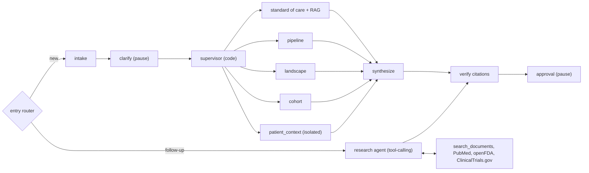

# Condition Briefing Agent

Cited condition briefings for a health system's strategy team, built live in one session.
Demo condition: dementia. All patient data and Northlake Health documents are synthetic.

---

## 1. Problem, user, outcome

- **Problem:** before a planning decision (open an infusion program? join trials? expand the memory clinic?),
  analysts spend days pulling guidelines, FDA approvals, trial pipelines, payer rules and our own capacity numbers
  into one briefing, and the sources are hard to trace afterwards.
- **User:** strategy analysts and service-line leaders on the healthcare team. Decision-maker: the planning
  committee.
- **Outcome:** a cited first draft in about 10-12 seconds that an analyst reviews and approves. Every statement
  links to a PMID, NCT ID, FDA application or internal document chunk.
- **Not the goal:** clinical decisions. The tool refuses to diagnose, prescribe or write treatment plans.

---

## 2. Discovery decisions

| Question | Client answer | What it changed |
|---|---|---|
| Who uses it? | Users on the healthcare team | Strategy framing, analyst approval gate |
| Interface? | Web chat | FastAPI + one-page chat UI with session sidebar |
| Volume? | About 5 runs a day | Synchronous runs, SQLite is enough, cost is negligible |
| Input? | A condition | Clarifying questions for subtype, focus, optional patient |
| Compliance? | PHI must be protected | Redaction, isolated patient step, audit log, BAA gap called out |
| Patient data? | A patient history tool | Synthetic panel, one isolated `patient_context` step |
| Memory? | SQLite, resumable sessions | LangGraph `SqliteSaver` checkpoints + sessions table |
| Observability? | LangSmith | Redacting tracer, experiments, analyst feedback |

---

## 3. Architecture

- **Code supervisor for the briefing:** the steps are always the same, so plain code fans out five parallel steps.
  Predictable, cheap, about 10-12 seconds.
- **One tool-calling agent for follow-ups:** open-ended questions need the model to pick tools. Capped at 6 calls.
- **Trust boundary:** only `patient_context` sees patient data, redacted. The agent has no patient tools.
- **Tradeoff named:** a fully agentic supervisor would be more flexible but slower and harder to test; we kept
  autonomy only where the question is open-ended.

---

## 4. RAG design and embedding choice

- **Corpus:** 11 synthetic Northlake Health documents (infusion capacity, payer policy, memory clinic referrals,
  MRI capacity for ARIA monitoring, workforce, CHNA, competitors, clinical pathway, caregiver program, strategy
  memo, research office).
- **Pipeline:** heading-aware chunks, dense top 20 + BM25 top 20, reciprocal rank fusion, Pinecone-hosted
  `bge-reranker-v2-m3` to top 5, "not in our documents" below a score threshold. Citations: `DOC:<doc_id>#<n>`.
- **Embeddings: OpenAI `text-embedding-3-large`, chosen by the client.** Local models were ruled out because the
  client's machine can't run them. Chroma stays as the store because storing and searching vectors is light work.
- **Smoke test:** a CMS-coverage query scored 0.473 against the coverage text and 0.07 against a donepezil
  sentence, so the model separates on-topic from off-topic text.
- **Retrieval eval (12 questions, one unanswerable; run 12:31):**

| Configuration | Recall@5 | MRR | Refuses the unanswerable one | p50 latency |
|---|---|---|---|---|
| text-embedding-3-large + rerank | 1.0 | 0.955 | yes | 1,212 ms |
| text-embedding-3-large, no rerank | 1.0 | 0.932 | no | 287 ms |
| text-embedding-3-small + rerank | 1.0 | 0.955 | yes | 640 ms |
| text-embedding-3-small, no rerank | 1.0 | 0.939 | no | 214 ms |

- **What the numbers say:** on 11 documents every configuration finds the right document in the top 5. The
  reranker is what earns its place: it lifts MRR and is the only setup that correctly says "not in our documents"
  for the out-of-scope question. `-3-small` ties `-3-large` here; the large model stays as the client's choice and
  for a bigger corpus, and the small model is a cost lever we can pull with evidence.

---

## 5. Sources and cite-or-refuse

- **Public:** PubMed (guidelines), openFDA (approved products and labels), ClinicalTrials.gov (pipeline).
- **Internal:** Northlake documents through RAG (synthetic).
- **Relevance filter:** ClinicalTrials.gov returns loosely matched trials; a relevance filter kept 198 of 225
  Alzheimer's trials and keeps off-topic ones (for example Huntington's) out of the pipeline.
- **Cite or drop:** each claim must cite a source returned in this run, of a type allowed in its section.
  Fabricated or missing citations remove the claim, and the briefing shows verified / total / removed counts.
- **Refuse:** below the rerank threshold the agent says the answer isn't in our documents instead of guessing.
- **Outage:** cached API responses are served and the briefing is flagged as stale.

---

## 6. PHI controls and the BAA gap

- **Minimum necessary:** patient records are de-identified before any model call; only the isolated
  `patient_context` step sees them.
- **Traces:** the LangSmith client masks names, SSNs, MRNs, phone numbers, emails and dates of birth in every
  traced input and output, including eval experiments.
- **Storage:** patient context is shown in chat but never stored with the briefing; cohort cells under 3 are
  suppressed.
- **Audit:** every patient access goes to an append-only log; database triggers block UPDATE and DELETE.
- **Untrusted text:** injected instructions in notes, API text and uploads are removed and logged; uploads with PHI
  patterns are rejected before any text leaves the machine.
- **The gap:** DeepSeek has no business associate agreement. Before real PHI: a BAA-covered endpoint (Azure OpenAI,
  Bedrock, or OpenAI under a BAA with zero data retention), SSO instead of the `X-User` header, and a HIPAA review.

---

## 7. Evaluation (real numbers only)

- **Golden set:** 22 cases (10 scope prompts, 7 guardrail groups, 5 live briefings), 92 checks, run on every
  change. Code scorers; uploaded as the LangSmith dataset `condition-briefing-golden`.
- **Earlier full run (before LangSmith mode):** 91/91 checks passed; briefings took about 10-12 seconds.
- **Baseline LangSmith experiment (`baseline-89ae077d`):** 92/92 checks; checks_pass_rate, all_checks_pass,
  grounded, phi_safe and scope_correct all 1.0. Mean latency 35.8 s per live case, but this ran while the machine
  was under heavy load from the parallel build (load average 50-140); the run four minutes earlier measured
  9.6-22.2 s per briefing (mean 11.3 s across all five live cases).
- **The eval caught a real bug:** "What treatment should our health system invest in?" was wrongly refused as a
  clinical request (scope 31/32). A narrower rule fixed it (32/32) without letting real clinical requests through.
- **The eval also caught a contract change:** the first baseline experiment scored 88/92 because the chat API
  started reporting `done` instead of `final` after approval. The briefing was still stored as final, so the check
  now asserts the stored status, the source of truth.
- **Data quality:** the ClinicalTrials.gov relevance filter kept 198 of 225 Alzheimer's trials.
- **After RAG and the follow-up agent:** TBD (before/after comparison in LangSmith).

---

## 8. Demo script, one failure and the lesson

1. "dementia", answer "Alzheimer's, service-line, P007" with the LangSmith trace open.
2. Point at a `DOC:` citation from the infusion capacity review.
3. Follow-up: "What does the payer policy require for infusion sites?"
4. Patient context for P007: redacted, labeled, injected instruction removed, audit log entry.
5. Restart the server and resume the session from the sidebar.
6. Refusal: "Should we start lecanemab for patient P002?"

**Failure:** the scope guardrail refused a legitimate strategy question ("What treatment should our health system
invest in?") because it matched a broad "treatment" pattern. **Lesson:** guardrails need allow cases in the golden
set, not only block cases; strict rules get loosened by evidence, not by feel.

---

## 9. Path to production and next steps

- **Production path:** BAA-covered model endpoint; SSO with roles; Postgres for sessions and checkpoints; managed
  vector store behind the same retriever interface; container on the client's cloud with secrets in a vault;
  LangSmith online evals on a 5-10% sample; alerts on error rate, p95 latency, cost, rejection rate and stale
  sources; analyst override rate as the main quality signal; every failure becomes a golden case.
- **Next 3 steps:**
  1. Runtime claim-support check: move the eval-time groundedness judge into `verify` for a sample of claims,
     calibrated against analyst labels.
  2. Shadow mode with 2-3 analysts for two weeks, tracking approval rate and edits per briefing.
  3. Move to a BAA-covered endpoint and SSO, then run the HIPAA review before any real PHI.
